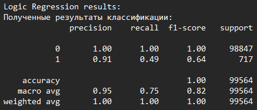
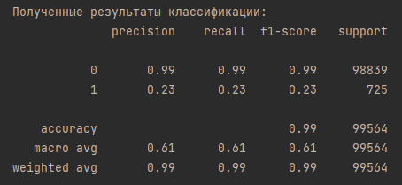

# Company Clust
Разработать решение для кластеризации названий компаний по идентичности обозначаемой компании.
Данные:


## Подготовка окружения:

```
conda create -n compclust python=3.7
conda activate compclust
pip3 install -r requirements.txt
```

## Оценка производительности и необходимного оборудования
Минимально рекомендуемое оборудование для single-thread инференса:<br>
1 vCPU, 4 Gb RAM<br>
Скорость инференса на single-thread Ryzen 5600h:<br> ~90 строк в секунду

Для повышения производительности инференса на больших объемах данных рекомендуется использовать многоядерный процессор и установить параметр n_estimators для RandomForest в соотвествии с числом потоков, для инференса нескольких деревьев в параллели.

## Масштабирование 
Решение можно масштабировать: обернуть демо-скрипт в воркер celery+redis+fastapi, затем создать оркестр воркеров с помощью, например, kubernetes

## Выбранные метрики
Наша основная метрика это f1-score.<br> 
Она отражает две метрики: recall и precision. В отличие от accuracy позволяет отразить наиболее 
приближенно к реальности результаты при дисбалансе классов, который у нас есть. 
Accuracy стабильно высока из-за перевеса класса '1' в соотношении более, чем 99 к 1.<br>

## Выбранная модель
В результате эксперимнтов выбрана модель RandomForestClassifier как модель с лучшей метрикой f1-score<br>
Лог экспериментов представлен ниже

## Подход 1: классификатор SKLearn
- Векторизация текстовых данных с помощью tf-idf<br>
- Train test split 80 / 20

Обучение классификатора дерево принятия решений DecisionTree<br>
<br>
Обучение классификатора случайный лес RandomForest<br>
<br>
Обучение классификатора логистическая регрессия LogisticRegression<br>
<br>
## Подход 2: кластеризатор SKLearn
- Векторизация текстовых данных с помощью tf-idf<br>
- Train test split: train - is_duplicate == 0, test - is_duplicate == 1
- Оптимизация гиперпараметров - поиск по сетке (GridSearch)

Обучение кластеризатора MiniBatchKMeans<br>
accuracy 0.563

Обучение кластеризатора MiniBatchKMeans и оптимизация гиперпараметров<br>
accuracy 0.745<br>
Подобранные параметры:<br>
{'init': 'k-means++', 'max_iter': 200, 'n_clusters': 5}

## Подход 3: эмбеддинги текста
Language-agnostic BERT Sentence Embedding (LaBSE)
- С помощью LaBSE извлекаем вектора признаков (эмбеддинги) предложений с помощью модели LaBSE
- Извлекаем меры схожести пар векторов (пар названий компаний) - евклидово и косинусное расстояния <br>
 
 <br>

## Эксперименты с косинусным расстоянием:<br>
- Train test split 80/20<br>
- Оптимизация гиперпараметров - Hyperopt

Обучение классификатора случайный лес RandomForest<br>
<br>
Обучение классификатора логистическая регрессия LogisticRegression<br>
<br>
Обучение и оптимизация гиперпараметров классификатора случайный лес<br>
<br>
Upsamling данных, обучение RandomForest<br>
<br> 
<br>

Upsamling данных, обучение LogisticRegression<br>
<br>
Upsampling данных, обучение и оптимизация гиперпараметров RandomForest<br>
<br>
## Эксперименты с евклидовым расстоянием:<br>
Обучение классификатора случайный лес RandomForest<br>
<br>
Обучение классификатора логистическая регрессия LogisticRegression<br>
<br>
Обучение и оптимизация гиперпараметров классификатора случайный лес<br>
<br>